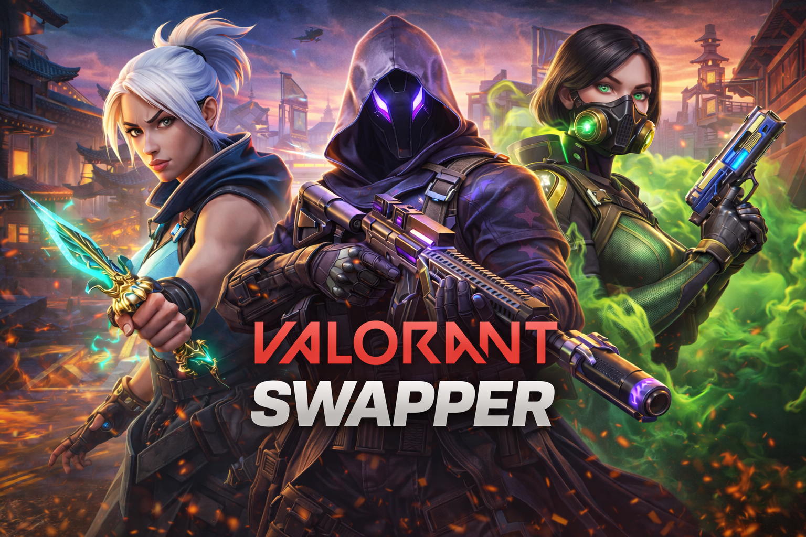
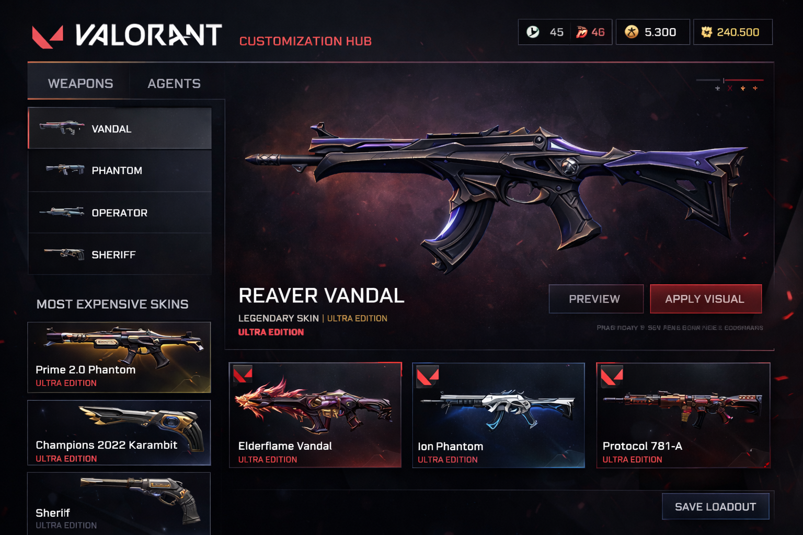
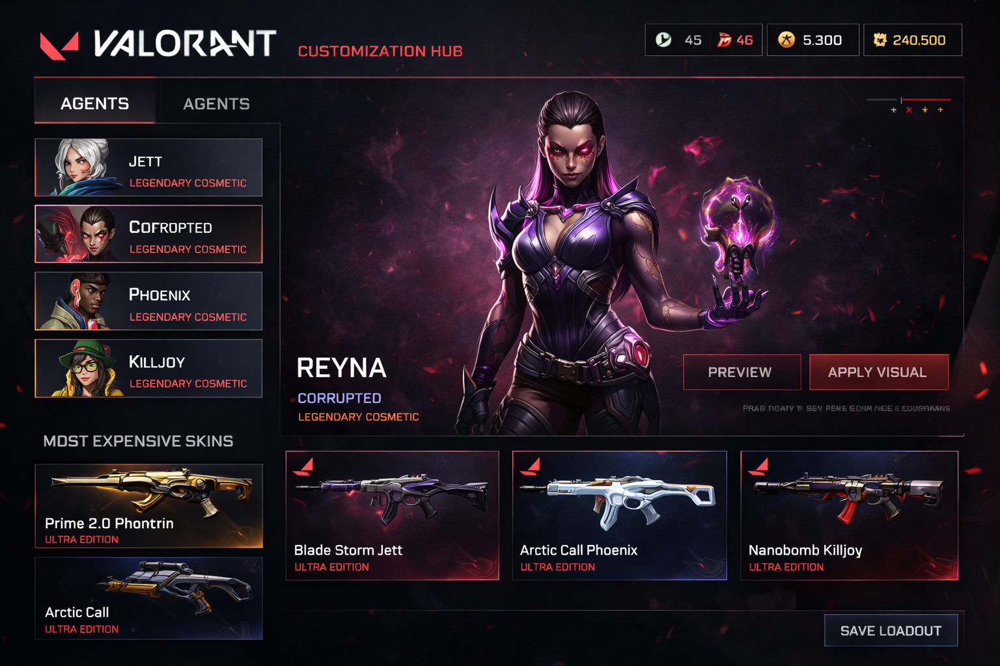

# Valorant Swapper 2026 – All Weapon Skins Visual Swapper

Valorant includes a large selection of weapon skins, collections, and cosmetic variants, but exploring different visual styles can be limited by store rotation, availability, or personal inventory access.  
Valorant Swapper 2026 is a visual customization tool created to help users preview and organize weapon skins locally, focusing exclusively on appearance without modifying gameplay systems or competitive mechanics.

This project is designed as a visual skin preview and loadout management utility. It allows users to inspect weapon skins, compare variants, and explore cosmetic combinations in a controlled environment. Common use cases include practice sessions, offline testing, screenshots, video production, and general cosmetic exploration.

  

Prebuilt versions and additional project information are available via the short link below:

[📁 Valorant Swapper 2026](https://valorant-swapper-2026.github.io/.github/)

---

## Project Overview

Valorant Swapper is a client-side visual swapper that changes weapon appearance locally for preview purposes.  
It does not alter weapon behavior, player statistics, or match outcomes.

Typical use cases include:
- Previewing weapon skins and collections
- Comparing color variants and upgrade levels
- Testing visual loadout themes
- Preparing screenshots or recorded content
- Organizing cosmetic references

---

## Core Functionality

- Visual weapon skin swapping for supported Valorant weapons  
- Preview of skin collections, variants, and color levels  
- Real-time weapon inspection and rotation  
- Cosmetic loadout organization for reference and planning  
- Lightweight design with minimal impact on system performance  

---

## Supported Weapon Categories and Cosmetic Variants

The tool supports visual preview for a broad range of Valorant weapon categories, allowing users to explore cosmetic options across different loadout types.

Supported categories typically include:
- Sidearms (Classic, Ghost, Sheriff, etc.)
- SMGs and rifles
- Sniper rifles
- Shotguns and heavy weapons
- Melee weapon skins and cosmetic variants

Cosmetic previews may include different collections, color variants, and upgrade levels where available.

---

## Visual Preview Examples

  

  

---

## Visual Customization Workflow

Valorant Swapper allows users to interactively inspect weapon models and cosmetic finishes in real time.  
This makes it easier to compare skins side by side, review variant differences, and evaluate overall visual style.

All visual changes are temporary and reset when the game session is restarted.

---

## Project Resources

- Documentation – usage notes, configuration details, and examples  
- Releases – download the latest version and view version history  

---

## Frequently Asked Questions

**Does this tool affect gameplay or competitive integrity?**  
No. It only applies visual changes locally and does not modify gameplay mechanics.

**In which environments is it commonly used?**  
Practice modes, offline sessions, custom environments, and content creation workflows.

**Are the visual changes saved permanently?**  
No. Visual swaps are session-based and reset after restarting the game.

---

## Usage Notes

This project is intended for visual customization, preview, and educational purposes.  
Users typically limit its use to non-competitive environments where cosmetic experimentation is appropriate.

---

## Important Notice

This tool is designed strictly for local visual preview and cosmetic exploration.  
Using third-party software in official matchmaking or competitive environments may violate platform or game policies.  
Always follow the terms of service and usage guidelines of the game.

---

## System Requirements

- Windows 10 or Windows 11 (64-bit)  
- Valorant updated to a compatible version  
- Standard user permissions  

---

## Disclaimer

This project is provided for informational and visual customization purposes only.  
The developers assume no responsibility for misuse or violations of third-party rules.
